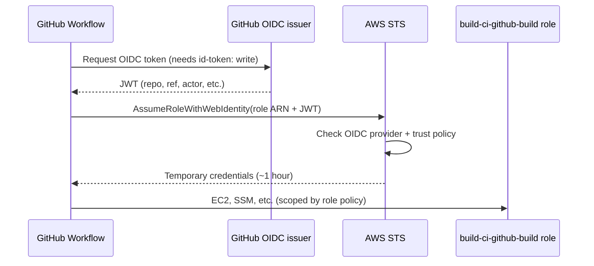

# AWS remote tests — GitHub Actions authentication

GitHub Actions authenticates to AWS using **OIDC (OpenID Connect)**. There are no long-lived `AWS_ACCESS_KEY_ID` / secret access keys stored in the repository for API access.

SSH to the ephemeral test host is separate and uses the `AWS_TEST_SSH_PRIVATE_KEY` GitHub secret.

---

## The chain in plain terms



---

## 1. What the workflow requests

In both AWS workflows:

```yaml
permissions:
  contents: read
  id-token: write   # Allows GitHub to mint an OIDC token for this run
```

Then:

```yaml
- uses: aws-actions/configure-aws-credentials@ececac1a45f3b08a01d2dd070d28d111c5fe6722 # v4
  with:
    role-to-assume: ${{ vars.AWS_TEST_ROLE_ARN }}
    aws-region: ${{ env.AWS_REGION }}
```

`AWS_TEST_ROLE_ARN` is a repository variable, typically:

```text
arn:aws:iam::290488660479:role/build-ci-github-build
```

The `configure-aws-credentials` action:

1. Obtains a JWT from GitHub's OIDC issuer (`https://token.actions.githubusercontent.com`)
2. Calls AWS STS `AssumeRoleWithWebIdentity` with that JWT
3. Exports short-lived environment variables (`AWS_ACCESS_KEY_ID`, `AWS_SECRET_ACCESS_KEY`, `AWS_SESSION_TOKEN`) for later steps (AWS CLI, `create-ephemeral-env.sh`, etc.)

Sessions are limited to **one hour** (`max_session_duration = 3600` on the role).

---

## 2. What AWS trusts (Terraform in build-ci)

Provisioned in `AWS-Cloud/build-account-isolation/build/iam.tf`.

### OIDC provider

Registers GitHub as a federated identity provider in the build-ci account (`290488660479`):

- URL: `https://token.actions.githubusercontent.com`
- Audience: `sts.amazonaws.com`

### Role trust policy

The `build-ci-github-build` role only allows assume when:

| Check | Value |
|---|---|
| Audience (`aud`) | `sts.amazonaws.com` |
| Subject (`sub`) | Must match `github_subject_claims` in Terraform |

Example subject for an RC tag run:

```text
repo:steveyminecraft/ansible-pihole:ref:refs/tags/v1.0.0-rc.1
```

Current claim in `build/terraform.tfvars` (as configured):

```hcl
github_subject_claims = [
  "repo:steveyminecraft/ansible-pihole:ref:refs/tags/v*-rc*",
]
```

### Which workflows match?

| Workflow | Typical `sub` claim | Matches current trust? |
|---|---|---|
| `rc-aws-remote-tests.yml` on RC tag push | `ref:refs/tags/v1.0.0-rc.1` | Yes |
| `aws-remote-tests.yml` manual dispatch | `ref:refs/heads/master` (or current branch) | **No**, unless you add a claim |
| `aws-remote-tests.yml` schedule | Default branch ref | **No**, unless you add a claim |

To allow manual or scheduled runs, add claims such as:

```hcl
github_subject_claims = [
  "repo:steveyminecraft/ansible-pihole:ref:refs/tags/v*-rc*",
  "repo:steveyminecraft/ansible-pihole:ref:refs/heads/master",
]
```

Then run `terraform apply` in `build/`.

---

## 3. What the role can do after authentication

Permissions come from the IAM policy attached to `build-ci-github-build` (also defined in Terraform). Relevant grants for remote tests include:

- **Describe** EC2 resources (images, instances, subnets, security groups)
- **Create** security groups and instances tagged `Project=ansible-pihole` at request time
- **Manage** security groups tagged `Project=ansible-pihole` on the resource
- **Terminate** instances tagged `Project=ansible-pihole`
- **Read** Ubuntu AMI IDs via SSM (`/aws/service/canonical/ubuntu/server/*`)

The role does **not** receive broad administrator access to the account.

Other permissions on the same role (artifacts S3, Secrets Manager under `/build/*`, CloudWatch logs) exist for broader build-ci use but are not required for the minimal remote test path.

---

## 4. What is not used

| Mechanism | Used for AWS remote tests? |
|---|---|
| IAM user access keys in GitHub secrets | No — OIDC replaces them for AWS API |
| Your local `rlaing` / `build-ci` AWS profiles | No — those are for human/Terraform use |
| Root or default AWS credentials | No |
| `AWS_TEST_SSH_PRIVATE_KEY` | Yes — but only for **SSH to EC2**, not AWS API auth |

---

## 5. Repository configuration summary

| Item | Type | Role |
|---|---|---|
| `AWS_TEST_ROLE_ARN` | Variable | Which IAM role OIDC should assume |
| `AWS_TEST_REGION` | Variable | AWS region for EC2 and STS |
| `AWS_TEST_SUBNET_ID` | Variable | Subnet for ephemeral hosts |
| `AWS_TEST_KEY_NAME` | Variable | EC2 key pair name |
| `AWS_TEST_INSTANCE_TYPE_AMD64` / `_ARM64` | Variable | Instance size per architecture |
| `AWS_TEST_SSH_PRIVATE_KEY` | Secret | Private half of the EC2 key pair |
| `AWS_TEST_PIHOLE_API_PASSWORD` | Secret | Pi-hole Web/API password for Ansible |
| `AWS_TEST_ANSIBLE_VAULT_PASSWORD` | Secret (optional) | Encrypts password in generated inventory |

A reference copy of the Pi-hole password may also exist in AWS Secrets Manager (`/build/ansible-pihole/pihole-api-password`) for operator lookup; CI uses the GitHub secret, not Secrets Manager.

---

## 6. Local operator access (contrast)

For comparison, when you run AWS CLI or Terraform locally:

| Profile | Account | Purpose |
|---|---|---|
| `rlaing` / `management` | Management (`158891109305`) | IAM user for org administration |
| `build-ci` | Build-ci (`290488660479`) | Assumes `OrganizationAccountAccessRole` |
| `game-servers` | Game-servers (`489287384645`) | Assumes `OrganizationAccountAccessRole` |

GitHub Actions never uses those profiles. It uses OIDC into `build-ci-github-build` with a token bound to the repository and git ref.

---

## Summary

GitHub proves **“this workflow run is `steveyminecraft/ansible-pihole` on ref X”** with a signed OIDC token. AWS STS exchanges that for temporary credentials **only if** ref X matches the IAM role trust policy. The role policy then limits what those credentials can do—primarily ephemeral EC2 and security groups tagged for ansible-pihole remote tests.

See also: [AWS remote tests — workflow guide](aws-remote-tests-workflow.md).
