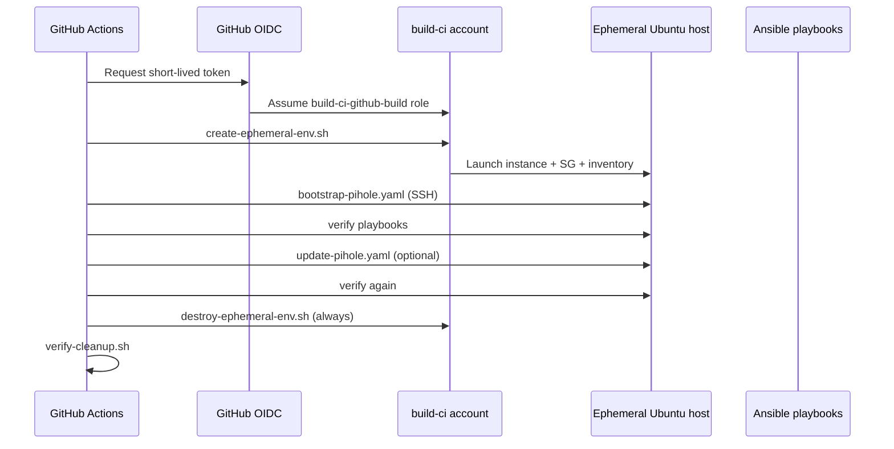

# AWS remote tests — workflow guide

This document explains how the GitHub Actions AWS remote test workflows operate, from trigger to teardown.

There are **two related workflows**. They share the same scripts and AWS setup; they differ mainly in **when they run** and **how much they test**.

| | **AWS RC remote tests** | **AWS remote functional tests** |
|---|---|---|
| File | `.github/workflows/rc-aws-remote-tests.yml` | `.github/workflows/aws-remote-tests.yml` |
| Triggers | RC tags (`v1.0.0-rc.1`) or manual | Manual only, plus weekly cron (Sunday 02:35 UTC) |
| OS | Ubuntu 26.04 amd64 only | Ubuntu 26.04 — single arch or amd64 + arm64 |
| Purpose | Pre-release gate on every RC tag | Ad-hoc testing and cheap weekly smoke |

Both follow the same core pattern: **assume AWS role → launch EC2 → Ansible → always destroy**.

---

## End-to-end flow



---

## `aws-remote-tests.yml` — section by section

### 1. Triggers (`on`)

```yaml
workflow_dispatch:   # Run workflow from GitHub UI
schedule:            # Weekly smoke, no human input
```

**Manual inputs:**

| Input | Purpose |
|---|---|
| `scenario` | `single` (Pi-hole + Unbound) or `no-unbound` |
| `test_matrix` | `single` (one arch) or `full` (amd64 + arm64) |
| `arch` | For `single` profile only: `amd64` or `arm64` |
| `skip_update` | Skip the update playbook |
| `aws_region` | Optional override; defaults to `AWS_TEST_REGION` repo variable |

The **schedule** ignores those inputs and always runs a minimal smoke: Ubuntu 26.04 amd64, `single` scenario.

### 2. Permissions and concurrency

```yaml
permissions:
  contents: read
  id-token: write      # Required for OIDC → AWS (no long-lived keys in GitHub)

concurrency:
  cancel-in-progress: true   # A new run cancels an in-flight one
```

### 3. Job 1: `prepare-matrix`

This job turns your inputs (or the schedule defaults) into a JSON matrix for job 2.

| Input profile | Matrix produced |
|---|---|
| `single` + amd64 | 1 job: Ubuntu 26.04 amd64 |
| `single` + arm64 | 1 job: Ubuntu 26.04 arm64 |
| `full` | 2 jobs: amd64 + arm64 |
| schedule | 1 job: Ubuntu 26.04 amd64 |

It also passes through **scenario**, **skip_update**, and **region**.

### 4. Job 2: `aws-remote-tests` (main work)

Runs once per matrix row (in parallel when `full`).

**Environment variables** wire GitHub configuration to the scripts:

| Variable | Source | Purpose |
|---|---|---|
| `AWS_TEST_ROLE_ARN` | repo variable | OIDC role in build-ci |
| `AWS_TEST_REGION` | repo variable | e.g. `eu-west-1` |
| `AWS_TEST_SUBNET_ID` | repo variable | Public ephemeral subnet |
| `AWS_TEST_KEY_NAME` | repo variable | EC2 key pair name |
| `AWS_TEST_INSTANCE_TYPE_*` | repo variable | e.g. `t3.small` |
| `AWS_TEST_SSH_PRIVATE_KEY` | repo secret | SSH to the new host |
| `AWS_TEST_PIHOLE_API_PASSWORD` | repo secret | Pi-hole API password in inventory |

**Step sequence:**

1. **Validate** — fail fast if vars/secrets are missing
2. **Checkout** — clone ansible-pihole
3. **Configure AWS credentials (OIDC)** — short-lived session as `build-ci-github-build`
4. **Set up Python + Ansible + collections**
5. **Prepare SSH** — write private key to a temp file (`chmod 600`)
6. **Run remote test harness** — calls `tests/remote/run.sh`
7. **Ensure cleanup** (`if: always()`) — destroy even if Ansible failed
8. **Verify cleanup** — confirm instance terminated and security group deleted
9. **Publish summary** — table in the Actions run summary

Steps 7–8 are the “never leave orphan EC2” safety net. Step 6 also registers cleanup inside `run.sh` via an exit trap.

---

## What `tests/remote/run.sh` does

The workflow sets:

```bash
REMOTE_CREATE_COMMAND=tests/remote/aws/create-ephemeral-env.sh
REMOTE_RESET_COMMAND=tests/remote/aws/destroy-ephemeral-env.sh
```

Then `run.sh`:

1. **CREATE hook** → `create-ephemeral-env.sh`
2. Check inventory exists (create script writes it)
3. **Converge** → `playbooks/bootstrap-pihole.yaml`
4. **Verify** → scenario-specific playbooks under `tests/remote/verify/`
5. **Update** → `playbooks/update-pihole.yaml` (unless `--skip-update`)
6. **Verify again**
7. **RESET hook** (on exit via `trap`) → `destroy-ephemeral-env.sh`

| Scenario | Verification playbooks |
|---|---|
| `single` | `pihole.yml`, `unbound.yml` |
| `no-unbound` | `pihole.yml`, `no-unbound.yml` |
| `ha` | Pi-hole, Unbound, keepalived, VIP DNS, Nebula Sync (not used by default AWS workflows) |

---

## What `create-ephemeral-env.sh` does

Each run gets a **fresh** host:

1. Resolve Ubuntu 26.04 AMI from SSM (`/aws/service/canonical/ubuntu/server/26.04/...`)
2. Create a **new security group** tagged `Project=ansible-pihole`, `Ephemeral=true`
3. Open SSH (22) and DNS (53) from `AWS_SSH_CIDR`
4. **RunInstances** with your key pair in the build-ci subnet
5. Wait for running + status OK
6. Write state files:
   - `AWS_STATE_FILE` — instance ID + SG ID (for destroy)
   - `AWS_INVENTORY_FILE` — Ansible inventory from template
   - `AWS_METADATA_FILE` — run metadata for the summary

The GitHub role can only create/terminate resources with `Project=ansible-pihole` (configured in the `AWS-Cloud` Terraform build stack).

---

## What cleanup does

**`destroy-ephemeral-env.sh`**

- Terminate instance(s) from the state file
- Wait until terminated
- Delete the per-run security group
- Write cleanup status JSON

**`verify-cleanup.sh`**

- Fails the job if anything is still running or the security group remains

You get cleanup from both `run.sh`'s exit trap **and** the workflow's `if: always()` steps.

---

## RC workflow differences

`rc-aws-remote-tests.yml` skips the matrix job:

- Fixed: Ubuntu 26.04 amd64
- Checks out the **tag ref** (`ref: ${{ github.ref_name }}`)
- Same create → run → destroy pipeline
- Instance name prefix `ansible-pihole-rc` (vs `ansible-pihole-remote` for manual runs)

That is what runs when you push a tag like `v1.0.0-rc.1`.

---

## Where AWS infrastructure lives

Not in ansible-pihole. The **build-ci** account (`290488660479`) is provisioned by `AWS-Cloud/build-account-isolation/build/`:

- OIDC trust for `steveyminecraft/ansible-pihole`
- Ephemeral test subnet and internet gateway
- EC2 key pair `build-ci-github-test`
- IAM permissions for tagged ephemeral hosts

GitHub repository **variables and secrets** are the bridge between that Terraform and these workflows.

See also: [AWS remote tests — authentication](aws-remote-tests-auth.md).

---

## Mental model

Three layers:

1. **GitHub** — orchestration, secrets, when to run
2. **AWS build-ci** — disposable compute per run (create/destroy scripts)
3. **Ansible** — the actual Pi-hole test (same playbooks used on real hardware)

The manual workflow is the **operator-friendly** version (manual + weekly). The RC workflow is the **release gate** (tag-triggered, single fixed config).
